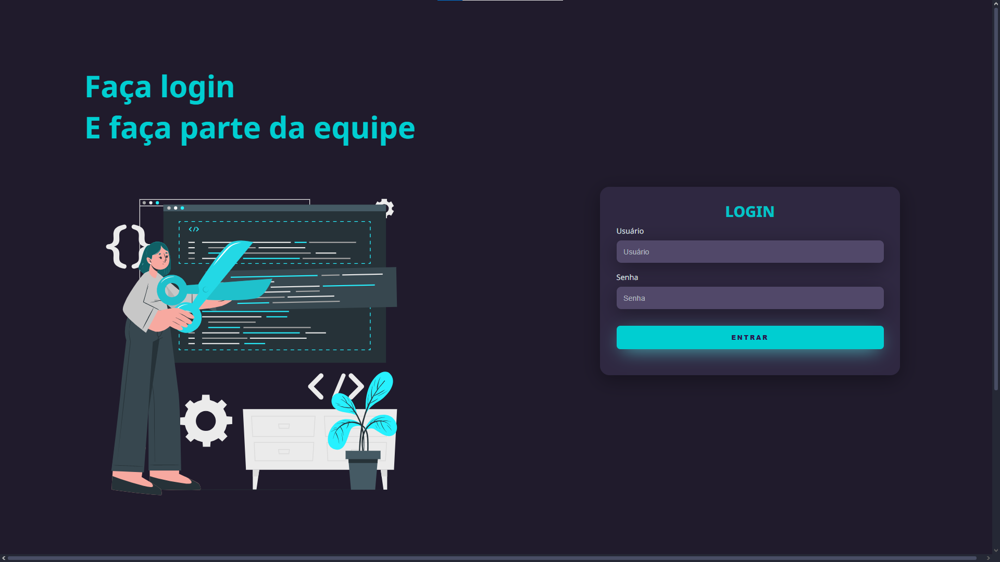

# Página de Login

Um projeto de página de login responsiva com design moderno e intuitivo.

##  Descrição

Este projeto consiste em uma página de login com interface dividida, apresentando uma área de boas-vindas à esquerda e um formulário de login à direita. 

## Tecnologias Utilizadas

##  Funcionalidades

- Interface de login 
- Campos para usuário e senha
- Design moderno com ilustração vetorial

##  Capturas de Tela

## Contato

Arthur Lima

<a href="https://www.linkedin.com/in/arthur-lima-027581326/" target="_blank">
